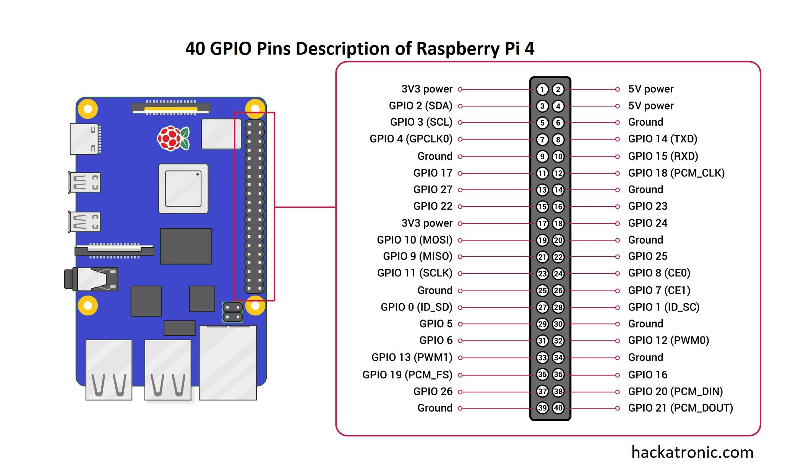
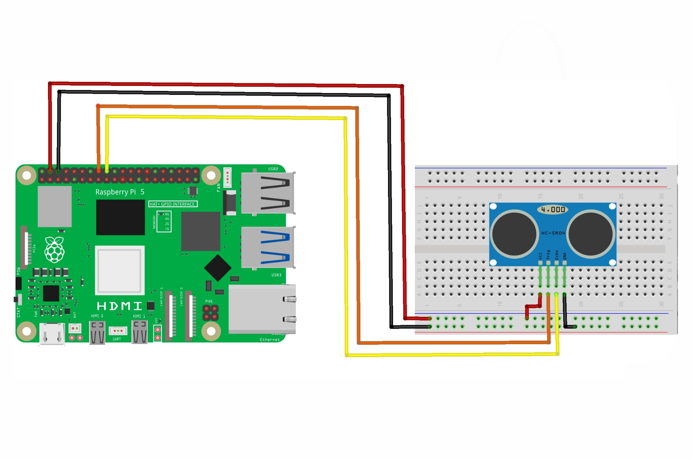
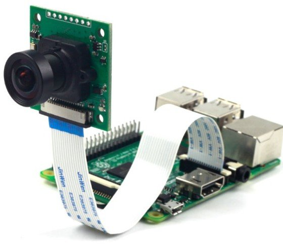
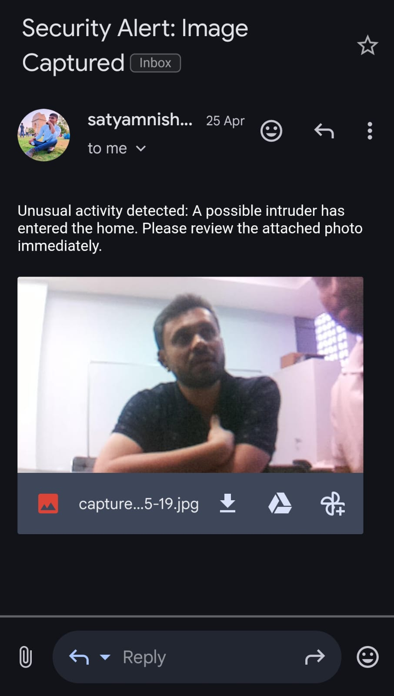

# 📷 Smart Surveillance System using Raspberry Pi 4

Hi, I am Satyam. Now I will be briefing this project — how this project is made, what are the components used, and the working flow of this project.

---

## 🧠 Objective

The goal of this project is to design and implement a smart security solution that detects intrusions using a Raspberry Pi 4, Camera Module, and Ultrasonic Sensor, and sends immediate email alerts with captured images. The system ensures energy efficiency and improves surveillance with automated, real-time notifications.

---

## ⚙️ Components Used

- Raspberry Pi 4 (with Raspbian OS)
- Ultrasonic Sensor (HC-SR04)
- Raspberry Pi Camera Module
- Jumper Wires
- Breadboard
- Python 3
- SMTP Library for Email Alert

---

## 💻 How Project is Made?

1. **Installing Raspbian OS in Raspberry Pi 4**  
   Install Raspbian OS on an SD card (32GB recommended) and insert it in the Raspberry Pi. Then connect the power supply.  
   **Note**: If you don't have an external monitor, you can simulate your laptop screen as a monitor via VNC software (watch a YouTube tutorial for this one).  
   Refer to the Raspberry Pi pin description below:  
   

2. **Interfacing with HC-SR04 (Ultrasonic Sensor)**  
   - TRIG pin --- GPIO 23  
   - ECHO pin --- GPIO 24  
   Refer to the circuit diagram below:  
   

3. **Interfacing Camera Module**  
   Refer to the image below for camera connection:  
   

4. **Code**  
   Change the sending and receiving email addresses according to you.  
   Run `code.py` file in Raspbian OS via Thonny Editor.

---

## 🔁 How the System Works?

1. The **Ultrasonic Sensor** continuously measures the distance to nearby objects.
2. If an object is detected within **20 cm**, the system:
   - Activates the **Raspberry Pi Camera Module** to capture an image.
   - Sends an **SOS email alert** with the image attached using the **SMTP** protocol.
3. If no object is detected in the critical range, the system remains in standby mode to conserve resources.

---

## 📸 Result

You can see the result in your mail.  

